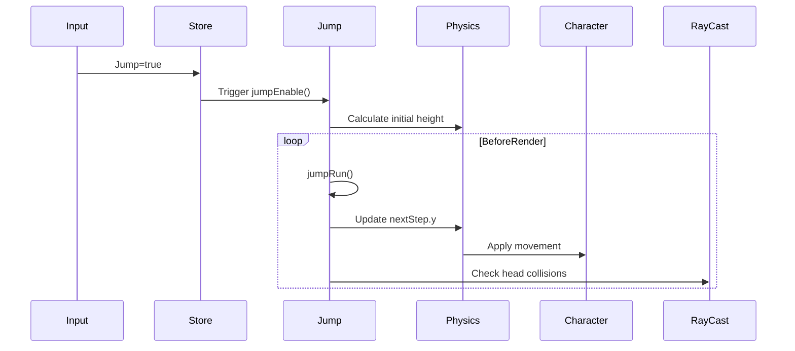

# Jump System Implementation

## Overview
The Jump system provides vertical movement capabilities for characters, with physics-based calculations for realistic jumping mechanics.

## Key Components
```typescript
class Jump {
  // Core properties
  private height: number;          // Current jump power
  private startHeight: number;     // Y position when jump started
  private speedRatio: number = 0.2; // Base vertical speed
  private nextStep: Vector3;       // Calculated movement

  // Dependencies
  private rayCast: RayCastHead;     // Head collision detector
  private jumpPad?: JumpPad;       // External boost system
}
```

## Execution Flow


## Core Methods
**1. Jump Initialization**
```typescript
jumpEnable(height: number) {
  if (this.player.move.isFlying) return;
  
  this.startHeight = this.meshFoot.position.y;
  this.height = height + this.player.move.speed;
  store.setJumpRunning(true); // Update global state
}
```

**2. Vertical Movement Calculation**
```typescript
private jumpRun() {
  const currentHeight = this.meshFoot.position.y;
  const remaining = (this.startHeight + this.height) - currentHeight;
  
  // Dynamic speed adjustment
  let speed = this.speedRatio * (remaining/this.height);
  speed = Scalar.Clamp(speed, 0.03, 0.4);
  
  this.nextStep.y = speed * engineDelta;
}
```

**3. Collision Prevention**
```typescript
private checkHeadRay() {
  if (this.rayCast.cast(collisionMesh => {
    return mesh.checkCollisions
  })) {
    this.jumpRunning = false; // Abort jump on ceiling hit
  }
}
```

## Modification Guide
**Adjust Jump Parameters**
1. Change base values in store settings:
```typescript
// store.ts
settings: {
  jumpHeight: 3.3,       // Normal jump
  jumpHeightSprint: 4.2  // Sprint jump
}
```

2. Modify inertia effects:
```typescript
// Jump.ts
private inertiaRun() {
  // Current horizontal boost
  const speed = this.height/80 * average;
  
  // Adjust these multipliers for air control
  if (this.lastForward.front) this.nextStep.z = speed * 0.95;
  if (this.lastForward.left) this.nextStep.x = speed * 0.8;
}
```

## Inter-system Dependencies
| System | Interaction Point |
|--------|-------------------|
| Movement | Receives ground state |
| Animation | Listens to jumpRunning |
| Network | Syncs jumpStart events |
| Sound | Triggers jump SFX |
| Physics | Provides delta timing |
